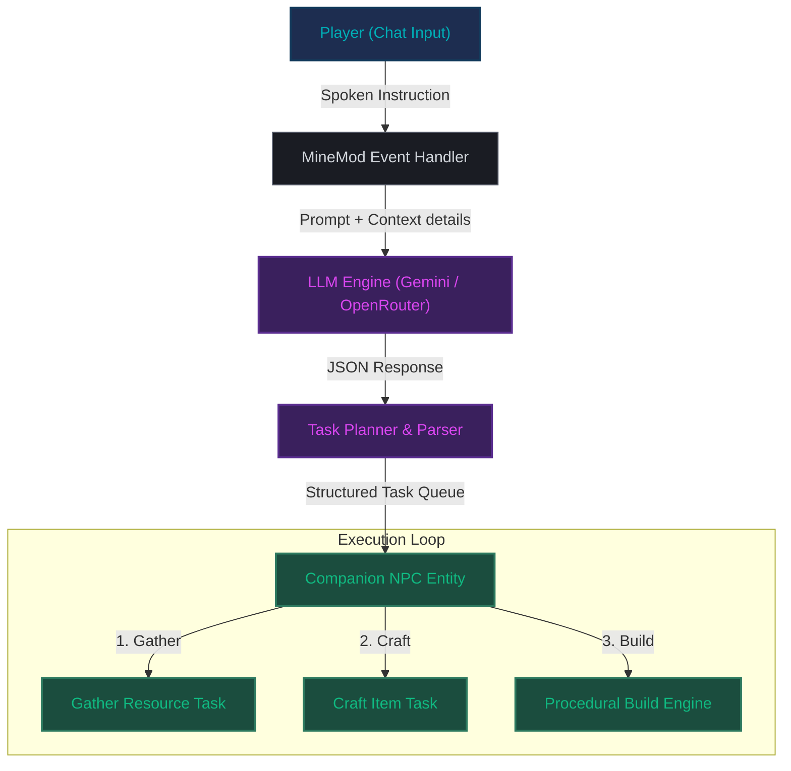

# 🤖 MineMod — Advanced AI Companion for Minecraft Forge

<div align="center">
  
  
  <br/>
  
  <h3><i>"Bring agentic AI intelligence directly into your survival world."</i></h3>

  <p align="center">
    
    
    
    
  </p>
</div>

---

## 🌌 Overview

**MineMod** is a next-generation Minecraft Forge modification that introduces a fully agentic **AI Companion NPC** into your game. Powered by **Google Gemini** and **OpenRouter's free-tier LLM models**, your companion doesn't just follow you around—it reasons, plans, crafts, and builds.

Simply chat with your companion in natural language. They will formulate a multi-step task list, execute it procedurally, gather resources, fight off monsters, and adapt to their memory and personality.



---

## ✨ Primary Capabilities

<details open>
<summary><b>🛠️ Procedural Architecture</b></summary>
<br>

*   **⚡ Smart Conversations:** Chat with your companion using natural language. They retain context, speak like an immersive, supportive co-op teammate, and write concise task logs.
*   **📐 Procedural Building (`PROCEDURAL_BUILD`):** Command your companion to build complex structures like `cottage`, `wall`, `tower`, or `farm` dynamically. Specify custom widths, lengths, heights, and block materials (e.g. wall = planks, roof = stairs).
*   **⛏️ Resource Gathering (`GATHER`):** Instruct your companion to harvest nearby materials such as logs, stones, coal, and food.
*   **🔨 Autonomous Crafting (`CRAFT`):** The companion calculates recipe trees to craft tools (axes, pickaxes) and blocks.
*   **🛡️ Active Defense (`ATTACK`):** Targets threatening mobs to keep you safe in combat.
*   **📦 Inventory Sorting (`ORGANIZE_CHESTS`):** Scans nearby chests to organize items and store surplus inventory.
</details>

---

## 🛠️ Recommended OpenRouter Free Models

MineMod features direct integration with **OpenRouter**, allowing you to harness free-tier LLM models. The table below represents the best-performing models benchmarked for structured JSON instructions and task reliability:

| Icon | OpenRouter Model ID | Focus / Strength | Suggested Usage |
| :---: | :--- | :--- | :--- |
| ⚡ | **`google/gemini-2.5-flash:free`** | Top-tier JSON formatting & speed | **Procedural Building** & Complex Queries |
| 🦙 | **`meta-llama/llama-3-8b-instruct:free`** | Conversational flow & friendly dialogue | General Companion interaction |
| 🎋 | **`qwen/qwen-2-7b-instruct:free`** | Detailed item recipe reasoning | **Resource Gathering & Crafting** |
| ⚙️ | **`nvidia/llama-3.1-nemotron-70b-instruct:free`** | High reasoning capability | Multi-phase coordinate planning |

---

## 🚀 Setup & Installation

### Step 1: Install Mod
1. Ensure you have **Minecraft 1.20.1** with **Forge 47.1.0** installed.
2. Drop `MineMod_1.20.1.jar` into your `.minecraft/mods/` directory.

### Step 2: Configure AI Settings (In-game Chat)
Open the Minecraft chat console and configure your chosen provider:

#### 🟢 Option A: OpenRouter Free Models (Recommended)
```text
/minemod openrouter setkey <your_api_key>
/minemod openrouter setmodel google/gemini-2.5-flash:free
/minemod provider openrouter
```

#### 🔵 Option B: Direct Google Gemini API
```text
/minemod gemini setkey <your_api_key>
/minemod gemini setmodel gemini-1.5-flash
/minemod provider gemini
```

### Step 3: Chat with Your Companion
To interact with your companion in the game, open the standard Minecraft chat and address them directly using the following format:

```text
Companion, <Prompt>
```

**Examples:**
* `Companion, follow me.`
* `Companion, gather 24 oak_log.`
* `Companion, craft a stone_pickaxe.`
* `Companion, build a cottage.`


---

## ⌨️ Command Console Cheat-Sheet

Format commands exactly as shown inside the Minecraft chat window:

| Command | Action |
| :--- | :--- |
| `/minemod status` | Displays active provider, connection state, and current model. |
| `/minemod summon` | Spawns or teleports your companion to your feet. |
| `/minemod provider <gemini/openrouter>` | Instantly swaps between providers. |
| `/minemod openrouter setkey <key>` | Sets the OpenRouter endpoint key. |
| `/minemod openrouter setmodel <model>` | Updates model (e.g. `google/gemini-2.5-flash:free`). |
| `/minemod runplan <filename>` | Executes a pre-configured automation script. |

---

## 📋 JSON Automation Plans (`runplan`)

Create complex, reproducible build actions by placing JSON scripts in the `minemod_plans/` folder inside your Minecraft directory. 

### Example Plan: `setup_base.json`
```json
{
  "tasks": [
    { "type": "FOLLOW" },
    { "type": "GATHER", "item": "minecraft:oak_log", "count": 24 },
    { "type": "CRAFT", "item": "minecraft:stone_axe", "count": 1 },
    { 
      "type": "PROCEDURAL_BUILD", 
      "structure": "cottage", 
      "width": 7, 
      "length": 8, 
      "height": 5, 
      "materials": { 
        "wall": "minecraft:oak_planks", 
        "roof": "minecraft:oak_stairs" 
      } 
    },
    { "type": "PLACE", "block": "minecraft:torch" },
    { "type": "STOP" }
  ]
}
```

Trigger it in-game with:
```text
/minemod runplan setup_base
```

---

## 🛡️ Built-in Failover Protection

If the API returns an error or rate limit, MineMod automatically falls back to alternative free-tier models sequentially to maintain your companion's responsiveness:

1. `meta-llama/llama-3-8b-instruct:free`
2. `nvidia/llama-3.1-nemotron-70b-instruct:free`
3. `nvidia/nemotron-4-340b-instruct:free`
4. `google/gemma-2-9b-it:free`
5. `qwen/qwen-2-7b-instruct:free`
6. `mistralai/mistral-7b-instruct:free`
7. `microsoft/phi-3-medium-128k-instruct:free`

---

<div align="center">
  <sub>Developed by <b>Antigravity</b>. Built for builders, survivalists, and AI enthusiasts.</sub>
</div>
